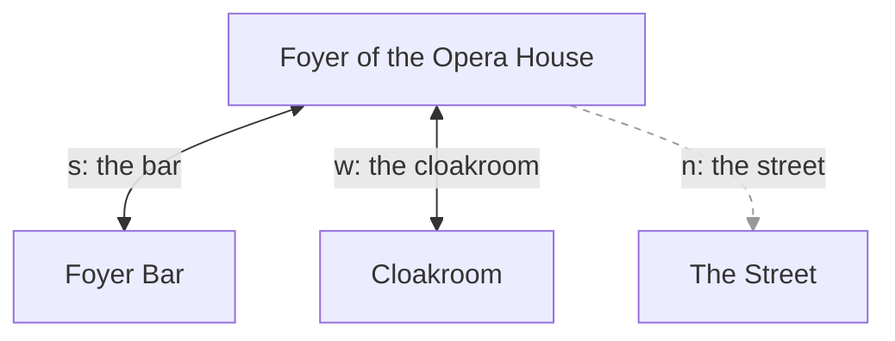

```mermaid
flowchart TD
    loc_foyer["Foyer of the Opera House"]
    loc_bar["Foyer Bar"]
    loc_cloakroom["Cloakroom"]
    loc_street["The Street"]
    loc_foyer <-->|s: the bar| loc_bar
    loc_foyer <-->|w: the cloakroom| loc_cloakroom
    loc_foyer -.->|n: the street| loc_street
    linkStyle 2 stroke:#999,stroke-dasharray:4 4
```
